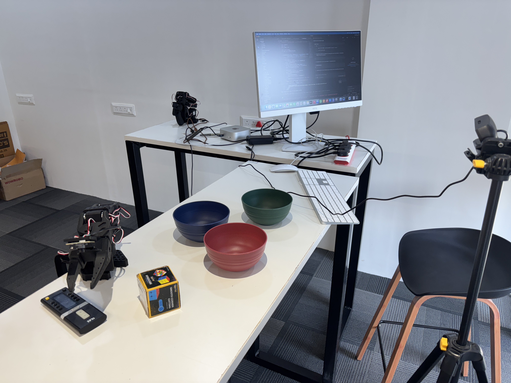

# SmolVLA on SO-101: Pick-and-Place with Vision-Language-Action Models



A complete pipeline for teaching a **SO-101** robot arm to pick up a box and place it in the correct colored bowl using **SmolVLA** (Vision-Language-Action model) with natural language instructions.

The robot understands not just "blue bowl" but also "the bowl that looks like the ocean" — semantic grounding from SmolVLA's VLM backbone.

---

## Table of Contents

1. [Prerequisites](#prerequisites)
2. [Installation](#installation)
3. [Hardware Setup](#hardware-setup)
4. [Calibration](#calibration)
5. [Step 1: Record Demonstrations](#step-1-record-demonstrations)
6. [Step 2: Train SmolVLA](#step-2-train-smolvla)
7. [Step 3: Run Inference](#step-3-run-inference)
8. [Voice-Controlled Inference](#voice-controlled-inference)
9. [Intent Classification Inference](#intent-classification-inference)
10. [RLT: Reinforcement Learning from Trajectory](#rlt-reinforcement-learning-from-trajectory)
11. [Critical Bugs & Fixes](#critical-bugs--fixes)
12. [HuggingFace Resources](#huggingface-resources)
13. [Repository Structure](#repository-structure)

---

## Prerequisites

### Hardware
- **SO-101 follower arm** (6-DOF + gripper, Feetech STS3215 servos)
- **SO-101 leader arm** (identical, for teleoperation during data collection)
- **2 USB webcams** — one overhead (bird's-eye view), one wrist-mounted
- **3 colored bowls** (red, green, blue) and a **box** to pick up
- **Mac with Apple Silicon** (M1/M2/M3/M4) for local inference, or Linux with CUDA GPU

### Software
- Python 3.10+
- [HuggingFace account](https://huggingface.co/join) with a write token
- [RunPod account](https://runpod.io) (or any cloud GPU provider) for training

---

## Installation

### 1. Clone this repository

```bash
git clone https://github.com/RajatDandekar/smolvla-so101.git
cd smolvla-so101
```

### 2. Set up LeRobot

Clone the patched fork (includes Windows/USB camera timeout fix for 1280×720 YUY2):

```bash
git clone https://github.com/omnaathg/lerobot.git lerobot
cd lerobot
pip install -e ".[smolvla]"
cd ..
```

### 3. Install additional dependencies

```bash
# For voice control
pip install openai-whisper sounddevice

# For intent classification
pip install sentence-transformers
```

### 4. Set your HuggingFace token

```bash
export HF_TOKEN=your_token_here
```

Or add it to your shell profile (`~/.zshrc` or `~/.bashrc`):

```bash
echo 'export HF_TOKEN=your_token_here' >> ~/.zshrc
source ~/.zshrc
```

---

## Hardware Setup

### Workspace Layout

Arrange your workspace as shown in the setup photo above:

1. **Follower arm** (SO-101) — mounted at the edge of the table, within reach of all bowls
2. **3 colored bowls** — red, green, blue — arranged in a row within the arm's workspace
3. **Box** — placed in the center, within easy grasp reach
4. **Overhead webcam** — mounted on a tripod or stand, pointing down at the workspace (camera index 0)
5. **Wrist camera** — attached to the robot's wrist (camera index 1)
6. **Leader arm** — placed nearby for teleoperation during data collection
7. **Mac** — connected to both arms and cameras via USB

### USB Connections

Connect both arms via USB serial. Find your ports:

```bash
# Activate the environment
source activate.sh

# Find connected robot ports
lerobot-find-port
```

Note the port paths. They look like:
- Follower: `/dev/tty.wchusbserial5AE60830811`
- Leader: `/dev/tty.wchusbserial5A7C1167331`

Update the port paths in the shell scripts if yours differ.

### Camera Setup

The cameras must be at **640x480 native resolution** (do NOT set them to 224x224 or 512x512 — SmolVLA's preprocessor handles resizing internally).

Test your cameras:

```bash
python show_cameras.py
```

**Important naming convention:**
| Physical Camera | Name in LeRobot | Name SmolVLA Expects |
|-----------------|-----------------|----------------------|
| Overhead webcam | `webcam` (index 0) | `camera1` |
| Wrist camera | `arm_cam` (index 1) | `camera2` |

A rename map handles this automatically in all scripts.

---

## Calibration

Calibrate both arms before first use. This only needs to be done once (calibration files are saved as `my_follower` and `my_leader`):

```bash
source activate.sh

# Calibrate the follower arm
lerobot-calibrate \
  --robot.type=so101_follower \
  --robot.port=/dev/tty.wchusbserial5AE60830811 \
  --robot.id=my_follower

# Calibrate the leader arm
lerobot-calibrate \
  --teleop.type=so101_leader \
  --teleop.port=/dev/tty.wchusbserial5A7C1167331 \
  --teleop.id=my_leader
```

Follow the on-screen instructions to move each joint to its limits.

---

## Step 1: Record Demonstrations

Record ~45 teleoperation episodes (15 per bowl color). A human moves the leader arm while the follower mirrors the motion, and both camera streams + joint positions are recorded at 30 Hz.

### Recording Protocol

| Parameter | Value |
|-----------|-------|
| Episodes per color | 15 |
| Total episodes | ~45 |
| Episode duration | 60 seconds max |
| Reset time | 15 seconds between episodes |
| Recording FPS | 30 Hz |
| Cameras | 2 (overhead + wrist) at 640x480 |

### Commands

```bash
# Record red bowl episodes (creates the dataset on HuggingFace)
./record_box_to_bowl.sh red

# Record green bowl episodes (appends to existing dataset)
./record_box_to_bowl.sh green

# Record blue bowl episodes (appends to existing dataset)
./record_box_to_bowl.sh blue
```

### What to do during recording

1. The robot enters teleoperation mode — the follower arm mirrors the leader arm.
2. **Pick up the box** with the leader arm.
3. **Place it in the specified bowl** (the color you passed to the script).
4. Press the record button to end the episode.
5. **Reset the workspace** (put the box back in the center) during the 15-second reset window.
6. Repeat for 15 episodes.

### Tips for good demonstrations

- Keep approach angles and grasp positions **consistent** across episodes.
- **Smooth, deliberate motions** work better than fast, jerky ones.
- Make sure the box is **fully inside** the bowl before ending the episode.
- If you mess up an episode, you can discard it and re-record.

### What gets recorded per timestep

```
observation.state:          [6 floats]   → shoulder_pan, shoulder_lift, elbow_flex, wrist_flex, wrist_roll, gripper
observation.images.webcam:  [480x640x3]  → overhead camera frame
observation.images.arm_cam: [480x640x3]  → wrist camera frame
action:                     [6 floats]   → leader arm joint positions (target)
task:                       string       → "Pick up the box and place it in the {color} bowl"
```

The dataset is automatically pushed to HuggingFace as `RajatDandekar/so101_box_to_bowl`.

---

## Step 2: Train SmolVLA

Training fine-tunes the pretrained `lerobot/smolvla_base` model on your recorded demonstrations. The VLM backbone retains its language understanding; the action head learns your robot's joint space.

### Option A: Train on RunPod (recommended)

Rent a GPU on [RunPod](https://runpod.io):

| GPU | VRAM | Batch Size | Training Time |
|-----|------|------------|---------------|
| A100 80GB | 80 GB | 64 | ~2 hours |
| A40 48GB | 48 GB | 32 | ~3.5 hours |
| 4090 24GB | 24 GB | 16 | ~5 hours |

**Setup on RunPod (run once after pod starts):**

```bash
apt-get update && apt-get install -y ffmpeg
pip install "lerobot[smolvla]"
huggingface-cli login --token $HF_TOKEN
```

**Run training:**

```bash
bash train_smolvla_box_bowl_runpod.sh
```

Or manually:

```bash
lerobot-train \
  --policy.path=lerobot/smolvla_base \
  --policy.repo_id="RajatDandekar/smolvla_box_to_bowl" \
  --policy.device=cuda \
  --policy.use_amp=true \
  --dataset.repo_id="RajatDandekar/so101_box_to_bowl" \
  --batch_size=64 \
  --steps=30000 \
  --num_workers=8 \
  --save_freq=5000 \
  --log_freq=50 \
  --output_dir=outputs/train/smolvla_box_to_bowl \
  --rename_map='{"observation.images.webcam": "observation.images.camera1", "observation.images.arm_cam": "observation.images.camera2"}'
```

The trained model is automatically pushed to HuggingFace as `RajatDandekar/smolvla_box_to_bowl`.

### Option B: Train locally on Mac (slower, for testing)

```bash
./train_smolvla_box_bowl.sh
```

This uses MPS (Apple GPU) with batch_size=8 and 10K steps. Much slower but useful for debugging.

### The rename map is essential

The camera names in the dataset (`webcam`, `arm_cam`) don't match what SmolVLA expects (`camera1`, `camera2`). The `--rename_map` flag handles this. **Forgetting it causes silent failures.**

---

## Step 3: Run Inference

Once trained, deploy the model for autonomous operation on your Mac.

### Basic inference (recommended for first test)

```bash
./run_inference.sh
```

This uses `lerobot-record` in policy mode, which handles everything correctly: action chunking, normalization, camera preprocessing.

The robot will autonomously execute the task specified in the script. Default task:

> "Pick up the box and place it in the bowl which has the same color as that of the ocean"

(This tests semantic grounding — "ocean" maps to blue.)

### What happens during inference

1. The cameras capture frames at 30 Hz (640x480).
2. SmolVLA receives the images + language instruction.
3. The model outputs an **action chunk** — 50 future joint positions.
4. Actions are queued and executed one per control step (33ms each).
5. When the queue empties (~1.7 seconds later), the model runs again.
6. This continues for the episode duration (default: 600 seconds).

### Changing the task

Edit the `--dataset.single_task` line in `run_inference.sh`:

```bash
--dataset.single_task="Pick up the box and place it in the green bowl"
```

Or use the voice/intent inference scripts (see below) for dynamic task switching.

---

## Voice-Controlled Inference

Run the robot with live voice commands. A background thread continuously listens via Whisper STT. Speak a new instruction at any time — the robot changes behavior on the next control step with **zero downtime**.

### Usage

```bash
# Voice mode (requires microphone)
python voice_inference.py

# Text mode (type instructions via keyboard)
python voice_inference.py --text_mode

# Custom initial task
python voice_inference.py --initial_task "Pick up the box and place it in the red bowl"

# More accurate STT model (slower)
python voice_inference.py --whisper_model small
```

### Or use the shell script

```bash
./run_smolvla.sh                                    # default task, text mode
./run_smolvla.sh "Pick up the box and place it in the blue bowl"  # custom task
```

### How it works

1. **Main thread** runs at 30 Hz: read cameras → SmolVLA forward pass → send actions to robot.
2. **Background thread** listens continuously via Whisper STT.
3. When you speak, the transcript updates a thread-safe `TaskState` object.
4. On the next control step, SmolVLA receives the new task string and adjusts behavior.

### Example voice commands

| What you say | What happens |
|-------------|--------------|
| "Put the box in the blue bowl" | Literal match → blue bowl |
| "Move it to the ocean-colored bowl" | Semantic grounding → blue bowl |
| "The grassy bowl" | Semantic grounding → green bowl |
| "The one that looks like blood" | Semantic grounding → red bowl |

The robot runs for up to 60 minutes. Press Ctrl+C to stop.

---

## Intent Classification Inference

For more robust voice control, the intent classification system maps free-form speech to **exact canonical task strings** using sentence-transformers semantic similarity.

### Usage

```bash
# Voice mode with video recording
python intent_inference.py

# Text mode (no microphone needed)
python intent_inference.py --text_mode

# Without video recording
python intent_inference.py --no_record
```

### How it works

1. Voice input → Whisper STT → raw text.
2. Sentence-transformer encodes the text.
3. Cosine similarity against reference phrases for each bowl color:
   - Green: "green", "grass", "leaves", "lime", "emerald", "forest"
   - Blue: "blue", "sky", "ocean", "sapphire"
   - Red: "red", "blood", "fire", "ruby"
4. Best match → canonical task string: `"Pick up the box and place it in the {color} bowl"`
5. SmolVLA runs inference with the exact training-time task string.

### Multi-episode support

The script supports continuous operation:
- Start recording → listen for instruction → classify → run episode → stop recording → prompt for next.
- Press Ctrl+C during an episode to end it early.
- Press Ctrl+C at the prompt to quit entirely.

---

## RLT: Reinforcement Learning from Trajectory

An experimental extension that adds RL fine-tuning on top of SmolVLA's frozen embeddings. The RL actor learns to handle precision phases (grasping, placement) where the base VLA may struggle.

### Stage 1: Train RLT Encoder (offline)

Trains an encoder-decoder on SmolVLA's embeddings from demonstration data:

```bash
python scripts/train_rlt_stage1.py
```

Checkpoint saved to `checkpoints/rlt_stage1/best_checkpoint.pt`.

### Stage 2: Online RL with Human Intervention

The robot runs SmolVLA autonomously. When it makes mistakes, you grab the leader arm to correct it. These corrections create high-quality transitions for RL training.

```bash
./run_rlt_stage2.sh
```

During an episode:
- Robot runs VLA autonomously.
- **Grab the leader arm** to intervene when the robot is about to fail.
- **Release** the leader arm after 5 seconds to return to VLA control.
- Press **right arrow** to end an episode.
- Press **Escape** to stop training.

### RLT Inference (VLA ↔ Actor switching)

```bash
./run_rlt_inference.sh
```

- Starts in VLA mode (robot moves normally).
- Press **SPACE** to switch to RL actor (for precision phases).
- Press **SPACE** again to return to VLA.
- Press **Ctrl+C** to stop.

### Current Status

| Metric | Value |
|--------|-------|
| Stage 1 encoder loss | 0.707 (converged) |
| Stage 2 episodes | 20 (5 warmup + 15 training) |
| RL updates | 630 |
| Actor status | Needs gradient clipping + more episodes |

See [RLT_NEXT_STEPS.md](RLT_NEXT_STEPS.md) and [RLT_STAGE2_LEARNINGS.md](RLT_STAGE2_LEARNINGS.md) for details.

---

## Critical Bugs & Fixes

These 10 integration bugs cost us significant debugging time. If you're building a similar system, read these carefully.

### 1. State Vector Order (THE BIGGEST BUG)

**Problem:** Using `sorted()` on joint names produces alphabetical order, but the model was trained with motor-definition order. Per-element normalization applies to the wrong joints → garbage model input → erratic motion.

**Fix:** Build state vector explicitly:
```python
JOINT_NAMES = ["shoulder_pan", "shoulder_lift", "elbow_flex", "wrist_flex", "wrist_roll", "gripper"]
state = [obs.get(f"{j}.pos", 0.0) for j in JOINT_NAMES]
```

### 2. Action Chunking — Must Use Action Queue

**Problem:** Calling `sample_actions()` every step (30 Hz) and using `action[0]` generates a new 50-step trajectory every 33ms → violent jerking.

**Fix:** Use `predict_action()` from `lerobot.utils.control_utils`. It manages an internal deque and only queries the model when the queue is empty.

### 3. Do NOT Call .float() on SmolVLA

**Problem:** `smolvla_policy.to(device).float()` changes numerical behavior.

**Fix:** Just `.to(device)` — no `.float()`.

### 4. Features Not Populated by from_pretrained

**Problem:** `SmolVLAPolicy.from_pretrained()` doesn't set `input_features`/`output_features`.

**Fix:** Manually set features using `PolicyFeature` before loading.

### 5. Preprocessor/Postprocessor Must Come from Checkpoint

**Problem:** Without normalization stats from training, model outputs are in normalized space — meaningless to the robot.

**Fix:** Load via `PolicyProcessorPipeline.from_pretrained()` from the HuggingFace checkpoint.

### 6. Camera Rename Map Required

**Problem:** `webcam`/`arm_cam` don't match `camera1`/`camera2`.

**Fix:** Use rename map in both training and inference.

### 7. Camera Resolution — Use Native

**Problem:** Non-native resolutions (224x224) cause camera driver failures.

**Fix:** Capture at 640x480. SmolVLA handles resizing internally.

### 8. Episode Length — 50 Steps Is Not Enough

**Problem:** Default 50 steps = 1.7 seconds. Pick-and-place needs 30-50 seconds.

**Fix:** `--steps_per_episode 1500` (50 seconds at 30 Hz).

### 9. torch.load Needs NormalizationMode Allowlisted

**Fix:** `torch.serialization.add_safe_globals([NormalizationMode])`

### 10. LeRobot Import Paths

It's `so_follower`, not `so101_follower`:
```python
from lerobot.robots.so_follower.config_so_follower import SOFollowerRobotConfig
from lerobot.cameras.opencv.configuration_opencv import OpenCVCameraConfig
```

### The Golden Rule

> Use `predict_action()` from `lerobot.utils.control_utils` — the exact same function `lerobot-record` uses. Don't reimplement the pipeline.

---

## HuggingFace Resources

| Resource | Repo ID |
|----------|---------|
| Training dataset | [`RajatDandekar/so101_box_to_bowl`](https://huggingface.co/datasets/RajatDandekar/so101_box_to_bowl) |
| Trained model | [`RajatDandekar/smolvla_box_to_bowl`](https://huggingface.co/RajatDandekar/smolvla_box_to_bowl) |
| Base model | [`lerobot/smolvla_base`](https://huggingface.co/lerobot/smolvla_base) |

---

## Repository Structure

```
.
├── lerobot/                       # LeRobot framework (vendored)
│   └── src/lerobot/
│       ├── policies/smolvla/      # SmolVLA policy implementation
│       ├── robots/so_follower/    # SO-101 arm driver
│       └── utils/control_utils.py # predict_action() lives here
│
├── scripts/                       # RLT training & inference
│   ├── train_rlt_stage1.py        # RLT encoder training
│   ├── train_rlt_stage2.py        # Online RL with human intervention
│   └── run_rlt_inference.py       # VLA↔Actor switching inference
│
├── voice_inference.py             # Voice-controlled SmolVLA (60 min autonomous)
├── intent_inference.py            # Intent classification inference
├── show_cameras.py                # Camera display utility
├── test_so101.py                  # SO-101 arm test
│
├── recordings/                    # Demo videos (47+ MP4 files)
├── checkpoints/                   # Model checkpoints (RLT stage 1 & 2)
├── docs/                          # Project webpage (GitHub Pages)
│
├── record_box_to_bowl.sh          # Record demonstrations (per bowl color)
├── train_smolvla_box_bowl.sh      # Train locally (Mac MPS)
├── train_smolvla_box_bowl_runpod.sh # Train on RunPod (A100)
├── run_inference.sh               # Basic autonomous inference
├── run_smolvla.sh                 # SmolVLA with text input
├── run_voice_inference.sh         # Voice-controlled inference
├── run_intent_inference.sh        # Intent classification inference
├── run_rlt_stage2.sh              # RLT Stage 2 training
├── run_rlt_inference.sh           # RLT inference with actor switching
├── activate.sh                    # Environment activation
│
├── RLT_STAGE2_LEARNINGS.md        # 10 critical integration bugs & fixes
├── RLT_NEXT_STEPS.md              # RLT training status & next steps
└── README.md                      # This file
```

---

## License

This project uses [LeRobot](https://github.com/huggingface/lerobot) (Apache 2.0) and [SmolVLA](https://huggingface.co/lerobot/smolvla_base).

---

*Built by Rajat Dandekar, March 2026*
